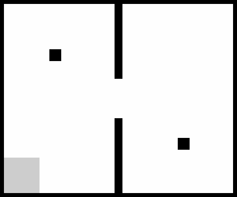
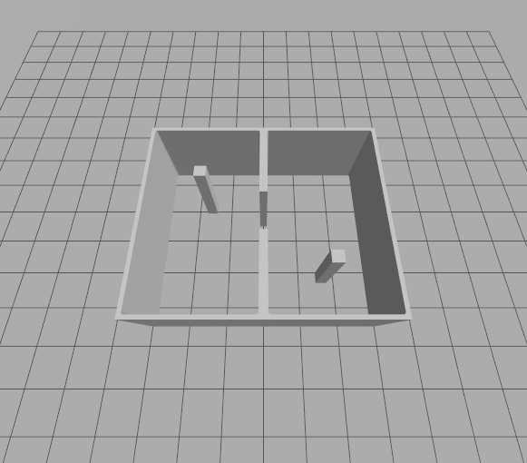

# map2sdf

[](https://github.com/atinfinity/map2sdf/actions/workflows/ci.yml)

A ROS 2 package that generates Gazebo (gz sim) SDF world files from
ROS 2 occupancy grid maps in the nav2 `map_server` format (YAML + PGM/PNG).

- Tested on: ROS 2 Jazzy / Gazebo Harmonic (gz sim 8)
- No extra Python dependencies (numpy / OpenCV / PyYAML only)

| Input: occupancy grid map | Output: Gazebo world |
| :---: | :---: |
|  |  |

## How it works

1. Loads the map YAML and image, and binarizes occupied cells using the
   same thresholding as nav2.
2. Traces the occupied regions as boundary polygons with holes
   (`cv2.findContours`), optionally simplified with Douglas-Peucker
   (`--simplify`), and offset onto cell boundaries so even one-cell walls
   keep their thickness.
3. Extrudes the polygons into watertight prisms (side walls plus
   triangulated top/bottom caps), writes them as a single binary STL
   mesh, and generates an SDF world that references it. With only one
   collision/visual pair, even large maps load fast.

The `origin: [x, y, yaw]` from the map YAML is applied to the wall model
pose, so the coordinate frame of the generated world matches the original
map frame.

## Build

```bash
cd ~/dev_ws
colcon build --packages-select map2sdf
source install/setup.bash
```

## Usage

```bash
ros2 run map2sdf map2sdf --map <map.yaml> -o <output-dir> [options]
```

| Option | Default | Description |
| --- | --- | --- |
| `--map` | (required) | path to the map YAML file |
| `-o, --out` | `.` | output directory |
| `--wall-height` | `2.0` | wall height in meters |
| `--world-name` | `map_world` | SDF world name, also used as the output file stem |
| `--no-ground` | - | do not add a ground plane |
| `--shadows` | - | enable shadows (disabled by default for lighter rendering) |
| `--unknown-as {free,occupied}` | `free` | how to treat unknown cells |
| `--occupied-thresh` | YAML value | override the occupied threshold |
| `--simplify TOL` | `0` (off) | approximate wall contours within TOL meters before meshing; greatly reduces the triangle count for jagged SLAM maps (features thinner than TOL may disappear) |

### Example: generate from the sample map and view in Gazebo

```bash
ros2 run map2sdf map2sdf \
  --map $(ros2 pkg prefix map2sdf)/share/map2sdf/maps/sample.yaml \
  -o /tmp/map_world
gz sim -r /tmp/map_world/map_world.sdf
```

Via the launch file (uses ros_gz_sim):

```bash
ros2 launch map2sdf map2sdf_demo.launch.py world:=/tmp/map_world/map_world.sdf
```

### Output files

The output directory will contain `map_world.sdf` and `map_world_walls.stl`.
The SDF references the mesh by a path relative to the world file, so the
pair keeps working as long as both files stay in the same directory —
no `GZ_SIM_RESOURCE_PATH` or other environment variables required.

## Supported map YAML fields

`image` (relative to the YAML), `resolution`, `origin`, `negate`,
`occupied_thresh`, `free_thresh`, `mode` (`trinary` / `scale` / `raw`)

Note: with the nav2 threshold semantics, a `free_thresh` of 0.25 classifies
the conventional unknown gray (205) as free. Use the classic 0.196 if you
want gray pixels to stay in the unknown band (see `--unknown-as`).

## Tests

```bash
colcon test --packages-select map2sdf && colcon test-result --verbose
```

## License

Apache License 2.0 — see [LICENSE](LICENSE).
